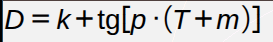
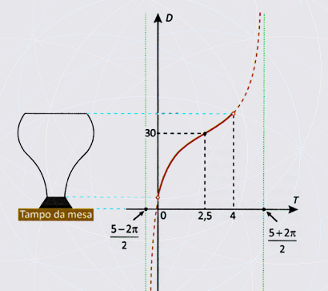
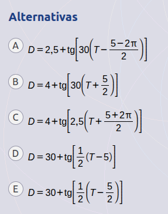

---

layout: default # Esse layout é o padrão visual, haverão outros, por hora só esse msm  
title: "Falhando na questão xarope do Enem"  
author: "wilski"  
date: 2025-11-28  
categories: [Matemática, Introdução, Errando] # aki pode-se adicionar outras categorias  

--- 

  Um recipiente tem um formato que faz com que, ao ser enchido de água com uma vazão constante, a distância *D* da lâmina de água ao tampo da mesa, em centímetro, aumente em relação ao tempo *T*, em minuto, de acordo com uma função do tipo

sendo os parâmetros *k*, *p* e *m* números reais, para *T* variando entre 0 e 4 minutos, conforme ilustrado na figura, na qual estão apresentadas assíntotas verticais da função tangente utilizada na definição de *D*.

A expressão algébrica que representa a relação entre *D* e *T* é

### 

O gráfico mostra a função tangente que define D, onde o eixo horizontal é o tempo T e o vertical é a distância D. 
Em resumo, precisamos encontrar os valores de k, p e m.

Primeiramente, observamos que no tempo 0, D não é 0, pois o copo já começa com uma certa distancia da mesa (a parte escura do copo); Isso se reflete no gráfico já que quando T é 0 D é um valor acima de 0 (o gráfico não nos diz).

O gráfico nos informa, no entanto, que quando quando T é 2,5 (passados dois minutos e meio), a distância D é de 30 (centímetros).

Voltando então para a função inicial e mudando esses valores, temos:

**e.q.1** $30 = k + tg[p * (2,5 + m)]$

Precisamos descobrir mais alguma coisa para poder eliminar alternativas..

As retas verdes verticais (assintotas) podem ser uteis aqui.
A primeira delas nos mostra que quando T for igual a $\frac{5-2\pi}{2}$,

D será $- \infty$; Qual a utilidade disso? Bom, a função tangente fica infinita (negativamente) quando o ângulo é exatamente $\frac{3\pi}{2}$

**(relembre o circulo trigonométrico)**

Voltando para nossa função, isso indica que $tg[p*(T + m)]$ tem que ser igual a $-\infty$ quando T é igual a $\frac{3\pi}{2}$. (footnote k não pode ser menos infinito, pois, lembre, k, m e p são constantes, então se k fosse menos infinito, D também sempre seria).

Então, podemos bolar a seguinte igualdade:

**e.q.2** $p * (\frac{5-2\pi}{2} + m) = \frac{3\pi}{2}$

(substituímos T por $\frac{5-2\pi}{2}$ na expressãozinha dentro da função tangente)

Isso é muito bom, já temos duas equações diferentes, mas como temos 3 incógnitas, precisamos de mais uma equação (claro, ou algum outro fato que possa matar a charada).

Vamos tentar o meso truque mas agora na segunda assíntota:

A função tangente fica infinita (tem assíntota) positivamente quando o ângulo é igual a $\frac{\pi}{2}$, portanto, olhando para o desenho do gráfico, na segunda reta verde, vemos que a função fica infinita quando T é igual a $\frac{5+2\pi}{2}$;

Vamos então fazer novamente uma equação utilizando esse fato:

**e.q 3** $p * (\frac{5+2\pi}{2} + m) = \frac{\pi}{2}$

Agora matamos a charada!

(Observem como nas equações 2 e 3 temos apenas 2 incógnitas, isso nos garante que podemos determinar seus valores!)

Observe que $\frac{3\pi}{2}=\frac{\pi}{2}+\pi$

Então, da e.q 2, $p * (\frac{5-2\pi}{2} + m) = \frac{\pi}{2}+\pi$

Isolando $\frac{\pi}{2}$, para igualarmos na e.q 3:

**e.q.2a** $p * (\frac{5-2\pi}{2} + m) -\pi = \frac{\pi}{2}$

Igualando então com a e.q 3:

$p * (\frac{5-2\pi}{2} + m) -\pi=p * (\frac{5+2\pi}{2} + m)$

(e.q.2a = e.q.3)

Vamos dividir ambos os lados por p:

$(\frac{5-2\pi}{2} + m) -\frac{\pi}{p}=(\frac{5+2\pi}{2} + m)$

o que é o mesmo que:

$\frac{5-2\pi}{2} + m -\frac{\pi}{p}=\frac{5+2\pi}{2} + m$

subtraindo então m nos dois lados:

$\frac{5-2\pi}{2}-\frac{\pi}{p}=\frac{5+2\pi}{2}$

rearranjando:

$\frac{5-2\pi}{2}-\frac{5+2\pi}{2}=\frac{\pi}{p}$

então:

$\frac{5-2\pi-5-2\pi}{2}=\frac{\pi}{p}$

ou seja:

$\frac{-4\pi}{2}=\frac{\pi}{p}$

ou ainda:

$-2\pi=\frac{\pi}{p}$

multiplicando tudo por p:

$-2p\pi=\pi$

dividindo tudo por $-2\pi$:

$p=-\frac{1}{2}$

Usando esse valor de p na equação 3:

$-\frac{(\frac{5+2\pi}{2} + m)}{2} = \frac{\pi}{2}$

vamos já multiplicar tudo por -2 para facilitar:

$(\frac{5+2\pi}{2} + m) = -\pi$

que é o mesmo que:

$\frac{5+2\pi}{2} + m = -\pi$

isolando o m então:

$m = -\pi - \frac{5+2\pi}{2}$

ou ainda:

$m = \frac{-2\pi -5-2\pi}{2}$

ou:

$m = \frac{-4\pi -5}{2}$

No entanto, notamos que nenhuma alternativa cita \pi, então algo está errado.
